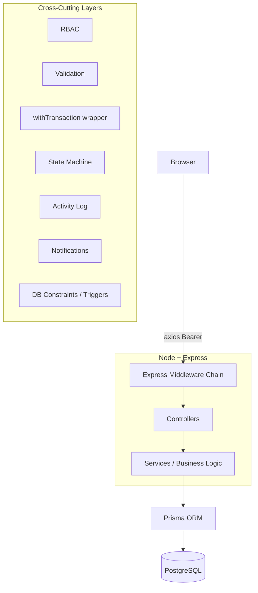

# Zenith Rentals

> A complete rental operations platform that enforces consistency in PostgreSQL, not application code.


Rental businesses lose money in three specific places: they double-book items because availability is a time-range question tracked on spreadsheets; they calculate late fees inconsistently by hand; and they manage security deposits outside the rental workflow, making reconciliation guesswork. This system covers the complete lifecycle — quotation → payment + security deposit → handover → return → penalty → deposit settlement → closure — and enforces the rules that matter in the database rather than in application code.

## The Problem

A rental operation is primarily a challenge of time and physical inventory. Double-booking happens when availability relies on spreadsheet lookups instead of hard constraints. Hand-calculated penalties drift based on which employee is working the return desk. Floating deposits tracked outside the financial ledger make reconciliation a guessing game. 

## Key Features

### Customer
- Browse catalogue with filters and sorting
- Date-range availability checks for precise booking
- Quotation generation
- Payment with integrated security deposit
- Order history tracking

### Admin
- Product, category, unit, and pricelist management with image uploads
- Operations dashboard for upcoming pickups and returns
- Handover and return inspection workflows
- Deposit settlement and late-fee processing

## Engineering Highlights

This project makes deliberate technical choices to enforce consistency at the data layer, removing entire classes of bugs from the application logic.

### No double-booking, enforced by PostgreSQL
Availability checks in application code are inherently susceptible to Time-of-Check to Time-of-Use (TOCTOU) race conditions. Instead, Zenith Rentals uses a PostgreSQL `EXCLUDE` constraint with a `tsrange` to make overlapping reservations physically unrepresentable in the database. Concurrent conflicts fail instantly at the database level, raising `SQLSTATE 23P01` which the application translates to a 409 Conflict.

```sql
ALTER TABLE "reservations"
  ADD CONSTRAINT "reservations_no_overlap"
  EXCLUDE USING gist ("productUnitId" WITH =, "during" WITH &&)
  WHERE (status IN ('HELD', 'ACTIVE', 'FULFILLED'));
```

### Deposits as an append-only ledger
Instead of a single mutable balance column that can drift out of sync, deposits are recorded as an append-only ledger of `HELD`, `DEDUCTED`, and `REFUNDED` entries. The current balance is derived by summation. A `BEFORE INSERT` database trigger locks the parent order and prevents any deduction or refund that would exceed the currently held balance, maintaining aggregate consistency without application-level races.

### Temporal correctness
Rates and late-fee rules are snapshotted onto transactional rows at the time they are applied (e.g., `RentalOrderLine.rateApplied` and `LateFee.capAmount`). This ensures that historical orders do not retroactively change their financial meaning when an admin edits a pricelist or store setting.

### Atomic multi-step operations
Complex workflows are wrapped in robust transactions. For example, confirmation (reserve + payment + deposit ledger) and return settlement (penalty + deduction + refund + release + close) run inside a `withTransaction` wrapper, ensuring all steps succeed or fail atomically.

```javascript
// server/src/lib/withTransaction.js
export function withTransaction(callback) {
  return prisma.$transaction(callback);
}
```

### Three-layer RBAC
Access control consists of three deliberate layers:
1. **Authentication**: JWT verification confirms identity.
2. **Role Check**: Middleware ensures the actor has the required role (e.g., `ADMIN`).
3. **Row-level Scoping**: Controller queries inject `where` clauses based on ownership (IDOR defense).

### Money as Decimal(12,2)
All monetary values are stored as exact base-10 `Decimal(12,2)`. Using floating point leads to binary rounding errors, and integer paise can lose scale contracts. Decimal(12,2) guarantees exact financial math.

### Payment integrity
Payment statuses are never updated based on client-reported success. The server performs an HMAC signature verification of the gateway payload (`crypto.createHmac`) before confirming any transaction and modifying the deposit ledger.

## Architecture



### Data Model Overview
- **Master Data**: `User`, `Category`, `Product`, `ProductUnit`, `Pricelist` — The core entities and inventory.
- **Transactional**: `RentalOrder`, `RentalOrderLine`, `Reservation`, `Payment`, `DepositLedger`, `Invoice`, `RentalEvent` — The operational history and financial lifecycle.
- **Cross-Cutting**: `ActivityLog`, `Notification`, `RentalSettings` — System configuration and audit trails.

## Tech Stack

| Layer | Technology | Why this choice |
|-------|------------|-----------------|
| **Database** | PostgreSQL | Native constraints, ranges, and EXCLUDE capabilities over MySQL. |
| **ORM** | Prisma | Typesafe schema and client over raw SQL, with raw SQL escape hatches for advanced constraints. |
| **Backend** | Node + Express | Fast iteration and extensive ecosystem. |
| **Frontend** | React + Vite + Tailwind v4 | Performant component model and rapid utility-first styling. |
| **Hosting** | Local DB over Hosted | Ensures offline operability, crucial for venue-based operational software. |


## Getting Started

### Prerequisites
- Node.js (v20.x or higher recommended)
- PostgreSQL (v14 or higher)

### Database Setup
Ensure PostgreSQL is running and create the user and database. Open `psql` and run:

```sql
CREATE ROLE zenith WITH LOGIN PASSWORD 'zenith';
CREATE DATABASE zenith_dev OWNER zenith;
-- Required for Prisma shadow database creations during migrations
ALTER ROLE zenith CREATEDB;
```

### Environment Setup
Copy the example environment file and configure it if necessary:

```bash
cd server
cp .env.example .env
```

### Install and Run

```bash
# Terminal 1: Server
cd server
npm install
npm run db:generate
npm run db:migrate
npm run db:seed
npm run dev

# Terminal 2: Client
cd client
npm install
npm run dev
```

### Demo Credentials

The following credentials are provided by the seed script:

| Role | Email | Password |
|------|-------|----------|
| **Admin** | `admin@zenith.dev` | `admin12345` |
| **Customer** | `alice@zenith.dev` | `customer12345` |
| **Customer** | `bob@zenith.dev` | `customer12345` |

*(Note: The old `employee@zenith.dev` account has been removed.)*

## API Overview

<details>
<summary>Click to expand key API endpoints</summary>

### Auth
- `POST /api/auth/login` — Public, Authenticate and receive JWT
- `POST /api/auth/register` — Public, Create a new customer account
- `POST /api/auth/refresh` — Public, Refresh JWT token

### Catalog
- `GET /api/catalog` — Public, List categories and products with pricing
- `GET /api/catalog/availability` — Public, Check product availability for a date range

### Payments
- `POST /api/payments/order` — Customer, Create a Razorpay order from a quotation
- `POST /api/payments/verify` — Customer, Verify HMAC signature and confirm payment
- `POST /api/payments/:orderId/penalty` — Admin, Settle outstanding late fees from deposit

### Rentals
- `POST /api/rentals` — Customer, Create a new rental quotation
- `GET /api/rentals` — Authenticated, List order history (scoped to user)

*(Additional modules include inventory, products, inspections, reports, and admin management).*
</details>

## Standard Response Envelope

```json
{
  "success": true,
  "data": { ... },
  "message": "Optional message",
  "meta": { "totalCount": 10, "page": 1, "limit": 10 }
}
```

## Project Structure

<details>
<summary>Click to expand folder tree</summary>

```text
odoo-x-ksv-final-2026/
├── client/                     # React + Vite frontend
│   ├── src/
│   │   ├── components/         # Reusable UI components (shadcn)
│   │   ├── features/           # Feature-sliced modules (admin, customer, auth)
│   │   ├── styles/             # Global CSS and Tailwind tokens
│   │   └── lib/                # API client and utilities
├── server/                     # Express API backend
│   ├── prisma/
│   │   ├── migrations/         # Prisma and hand-written SQL migrations
│   │   ├── schema.prisma       # Database schema and models
│   │   └── seed.js             # Idempotent database seed script
│   ├── src/
│   │   ├── modules/            # Domain modules (auth, payments, rentals, etc.)
│   │   ├── middleware/         # Express middleware (auth, RBAC, etc.)
│   │   └── lib/                # Shared utilities (jwt, withTransaction, etc.)
├── docs/                       # Architecture decisions and diagrams
└── README.md                   # This file
```
</details>

## Troubleshooting

| Issue | Cause / Solution |
|-------|------------------|
| **P3014 Shadow Database Error** | Prisma needs to create a shadow DB to run migrations safely. Run `ALTER ROLE zenith CREATEDB;` in postgres. |
| **Prisma EPERM on locked engine** | Windows-specific issue where the Prisma engine is locked by another process. Stop the node server, kill hanging node processes, and retry. |
| **curl vs curl.exe** | On Windows PowerShell, `curl` is an alias for `Invoke-WebRequest`. Use `curl.exe` to test API endpoints. |
| **Port Conflicts** | If port 5000 or 5173 is in use, kill the existing process or change the port in `.env` and `vite.config.js`. |
| **Line Endings (CRLF vs LF)** | Git on Windows might convert line endings to CRLF, which can break shell scripts. Set `core.autocrlf` appropriately. |

## Roadmap

- Implement short-lived token TTL with full refresh-token rotation
- Complete AI integration for predictive maintenance tickets
- Expand reporting dashboards with export functionality

## Team & Acknowledgements

**Team Odoo Zenith**, built for the Odoo × KSV Hackathon 2026.
